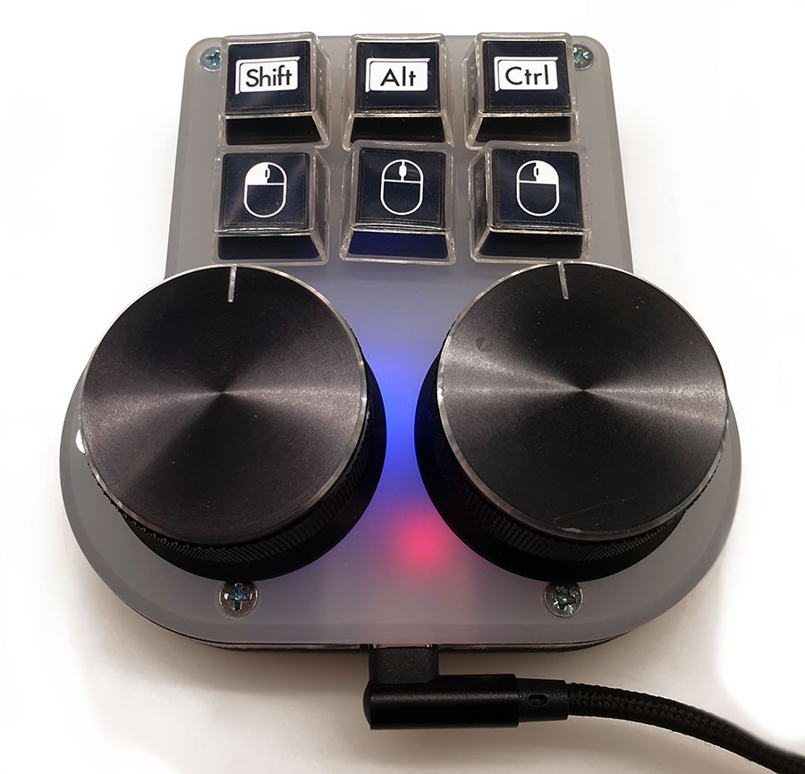
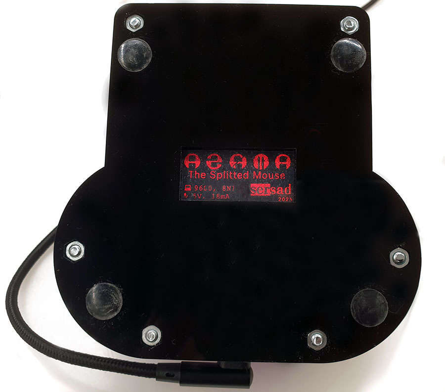

# Agata

 

## Table of contents
* [Overview](#overview)
* [Hardware](#hardware)
* [Software](#software)
* [History](#history)

## Overview
Back in the 1980's, the famous russian personal computer ["Agat"](http://agatcomp.ru/agat/index.shtml) has very unusual cursor control system: two independent controllers for the X and Y axes. This was convenient for games if you played with a partner, but was completely useless for other software. However, there were almost no programs that used the graphics mode.

 
<a href="https://ru.pc-history.com/">Image from https://ru.pc-history.com/</a>

But nowadays independent axis control may be very useful for working with CAD or graphics software. So this simple project brings us back to good old technology.

This device has two encoders for independent axis control and six keys. Each key has a latched state, so you don't have to hold them down while operating the encoders.

You can switch between fine and coarse mode by holding encoders key while rotating.

The devise implements HID protocol and needs no drivers for your OS.

## Hardware
The device is based on:
*  `Arduino Pro Micro ATMega32U4` 
*  Two encoders `EC-11`
*  Six latch-switches `8.5x8.5 mm`
*  12 capacitors to prevent the chatter. `0.1uF`

## Software
This device emulates a HID keyboard and HID mouse. When you rotate the encoder, the mouse pointer moves along the selected axis. The `X axis` for the `right` encoder and the `Y axis` for the `left` encoder by default.

If you hold the encoder key while rotating, the mouse pointer will move slowly.

Pressing one of the six additional keys will send a `KeyDown` event. Pressing it again will send a `KeyUp` event. So you don't need to hold these buttons down.

In addition to emulating HID devices, Agata also sends and receives messages via a COM port. You can connect to it using any COM terminal program. Port specification: `9600 8N1`. This connection can be used to configure devise settings.

Available configuration commands are:

|Command|Params|Description|
|:---:|:---:|:---|
|`h`|none|Get the list of available commands|
|`?`|none|Get the version information and current configuration|
|`&`|`F`|Reset the configuration to defaults. Example: `&F`|
|`d`|none|Turn on or off debug messages to the COM-port|
|`s`|none|Swap `left` and `right` encoders.|
|`k`|`X=C`|Assign the code `C` to the `X` key. Example: `k1=0x02`. The code **0x02** will be assigned to the key **1**. See [List of available codes](#List-of-available-codes) for details.|
|`i`|`X`|Invert the `X` key status (pressed/released). Example: `i2`. *The status of key **2** will be inverted. Device will send a `down` event when key is `up` and vice versa*. The current key status is displayed before the key name in the current configuration. **"+"** for non-inverted keys and **"-"** for inverted keys.|
|`l`|`A, B`|Set the `left` encoder resolution. `A` - increment of axis in `fine` mode, `B` - increment of axis in `coarse` mode. Example: `l=1,10` *The `Left` encoder will increase the `y-coordinate` by **1** each step of clockwise rotation in `fine mode` (when the encoder button is pressed) and by **10** in `coarse` mode (when the encoder button is released).*|
|`r`|`A, B`|Set the `right` encoder resolution. `A` - increment of axis in `fine` mode, `B` - increment of axis in `coarse` mode. Example: `r=-5,-50` *The `Right` encoder will **decrease** the `x-coordinate` by **5** each step of clockwise rotation in `fine mode` (when the encoder button is pressed) and by **50** in `coarse` mode (when the encoder button is released).*|

### List of available codes

|Command|DEC|HEX|
|:---|:---:|:---:|
|`MOUSE_LEFT`|1|0x01|
|`MOUSE_RIGHT`|2|0x02|
|`MOUSE_MIDDLE`|4|0x04|
|`KEY_LEFT_CTRL`|128|0x80|
|`KEY_LEFT_SHIFT`|129|0x81|
|`KEY_LEFT_ALT`|130|0x82|
|`KEY_LEFT_GUI`|131|0x83| 
|`KEY_RIGHT_CTRL`|132|0x84|
|`KEY_RIGHT_SHIFT`|133|0x85|
|`KEY_RIGHT_ALT`|134|0x86|
|`KEY_RIGHT_GUI`|135|0x87|

## History
* 1.0 - First stable release. 2025-03-16.